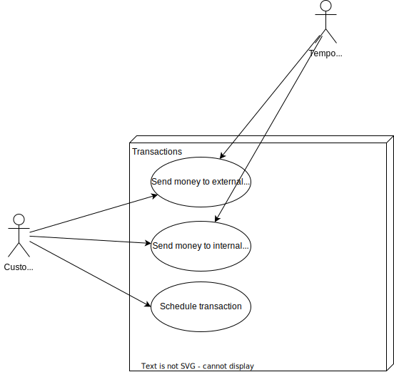

# Banking Platform: Use Cases

## Domain: Transaction Processor
Responsible for the processing user-initiated transaction

## Domain: Transaction History
Responsible for displaying transaction history